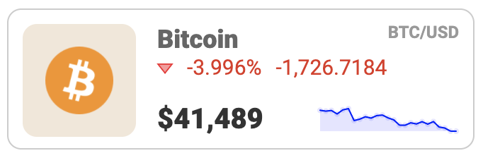

## Incorta SDK Cryptocurrency Component

This Incorta component uses an external API to fetch cryptocurrency values and format
the data into tiles. It also fetches price history for 24 hours and displays a sparkline. It refreshes the data periodically. It displays an icon for each coin and computes the color for the surrounding rounded box using the dominant icon color. -It also multiplies the positions held by the current price to display the market value.-

To try it out:

- `git clone` the repository
- `cd` into the project directory and install dependencies: `npm install`
- Run the incorta component server: `create-incorta-visual start`
- Navigate to the Incorta analyzer and choose the Developer Visual plugin
- Drag columns containing coin identifiers (i.e. 'bitcoin', 'ethereum'), and column containing coin holdings into the binding tray

See the [SETUP](./SETUP.md) doc for development environement setup instructions.

#### Future improvements

- Internationalization
- Allow the user to select a base currency
- Computation of total portfolio value
- Add tests
